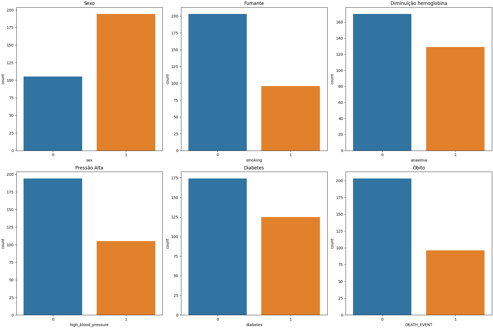
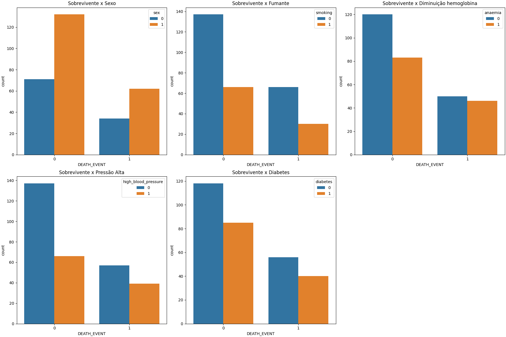
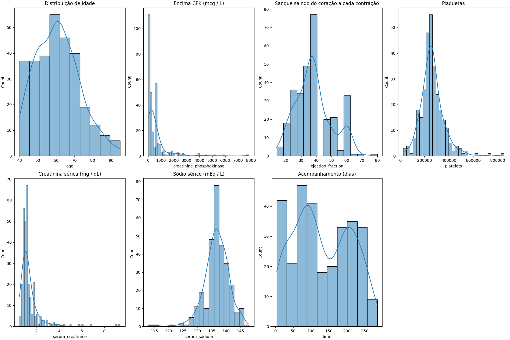
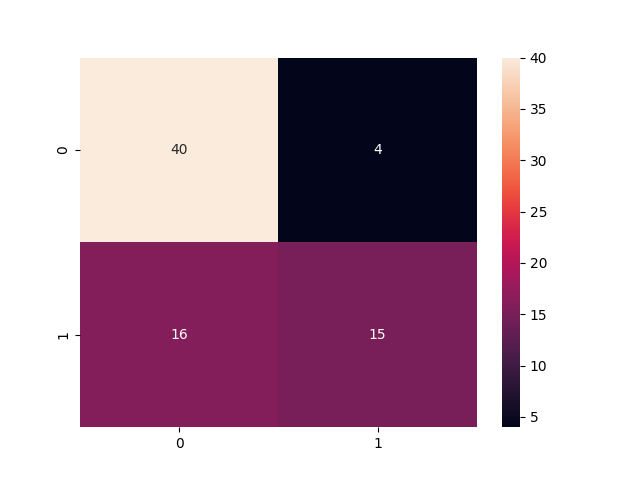

Repositório: https://github.com/DanielCastriani/Previsao-de-insuficiencia-cardiaca

# Previsão de insuficiência cardíaca


## Como executar

É necessário criar um virtual environment, e instalar as bibliotecas necessárias para executar o projeto:

```sh
python -m venv .venv
source .venv/bin/activate
pip install -r requirements.txt
```

Em seguida, é necessário criar uma pasta data/ na raiz do projeto e adicionar os arquivos do [Dataset](https://www.kaggle.com/andrewmvd/heart-failure-clinical-data)

Para rodar todas as funções, basta executar o arquivo main.py
```
python Previsao-de-insuficiencia-cardiaca.py
```

Caso ocorra o seguinte alerta, basta instalar o python3-tk:  
```
UserWarning: Matplotlib is currently using agg, which is a non-GUI backend, so cannot show the figure. 
```

```bash
sudo apt-get install python3-tk
```

## Estrutura do projeto

```
├── bin                     # arquivos binários em formato pickle (model, scaler)
├── data                    # Arquivos que contem os dados
├── database                # Scripts utilizados para carregar os dados
|   ├── sql                 # .sql files
│   ├── import_data.py      # Script de criação do arquivo db.sqlite
│   └── ...
├── eda                     # Analise exploratória de dados
├── feature_engineering     # Engenharia de features e preprocessamento
├── public                  # Arquivos publics distribuídos pela api
|   └── img                 # Imagens publicas
|       └── plots           # Plots
├── utils                   # Módulos de utilidade
```

## Dataset

[Dataset - Heart Failure Prediction](https://www.kaggle.com/andrewmvd/heart-failure-clinical-data)

É realizada a leitura do heart_failure_clinical_records_dataset.csv e posteriormente os dados são gravados em um arquivo .sqlite

### Dicionário de dados

| Feature                  | Descrição                                                                   | Tipo       |
| ------------------------ | --------------------------------------------------------------------------- | ---------- |
| age                      | Idade da pessoa                                                             | Float      |
| anaemia                  | Diminuição de glóbulos vermelhos ou hemoglobina                             | Int 0 ou 1 |
| creatinine_phosphokinase | Nível da enzima CPK no sangue (mcg / L))                                    | Int        |
| diabetes                 | Se o paciente tem diabetes                                                  | Int 0 ou 1 |
| ejection_fraction        | Porcentagem de sangue saindo do coração a cada contração                    | Int        |
| high_blood_pressure      | Indica se paciente tem pressão alta                                         | Int 0 ou 1 |
| platelets                | Plaquetas no sangue (kiloplatelets/mL)                                      | Float      |
| serum_creatinine         | Nível de creatinina sérica no sangue (mg / dL)                              | Float      |
| serum_sodium             | Nível de sódio sérico no sangue (mEq / L)                                   | Int        |
| sex                      | Mulher ou homem                                                             | Int 0 ou 1 |
| smoking                  | Se paciente fuma ou não                                                     | Int 0 ou 1 |
| time                     | Período de acompanhamento (dias)                                            | Int        |
| DEATH_EVENT              | Se o paciente evoluiu a óbito durante o período de acompanhamento \[TARGET] | Int 0 ou 1 |


## Analise exploratória de dados

Sobre o dataset
- Quantidade de observações(linha): 299
- Quantidade de features (colunas): 12

- Variável target: DEATH_EVENT
  - Recuperados: 203          67.89297658862876
  - Óbitos: 96               32.10702341137124

- Não há nenhum valor faltante


### Variáveis numéricas

| Coluna                   | count | mean          | std          | min     | 25%      | 50%      | 75%      | max      |
| ------------------------ | ----- | ------------- | ------------ | ------- | -------- | -------- | -------- | -------- |
| age                      | 299.0 | 60.833893     | 11.894809    | 40.0    | 51.0     | 60.0     | 70.0     | 95.0     |
| creatinine_phosphokinase | 299.0 | 581.839465    | 970.287881   | 23.0    | 116.5    | 250.0    | 582.0    | 7861.0   |
| ejection_fraction        | 299.0 | 38.083612     | 11.834841    | 14.0    | 30.0     | 38.0     | 45.0     | 80.0     |
| platelets                | 299.0 | 263358.029264 | 97804.236869 | 25100.0 | 212500.0 | 262000.0 | 303500.0 | 850000.0 |
| serum_creatinine         | 299.0 | 1.393880      | 1.034510     | 0.5     | 0.9      | 1.1      | 1.4      | 9.4      |
| serum_sodium             | 299.0 | 136.625418    | 4.412477     | 113.0   | 134.0    | 137.0    | 140.0    | 148.0    |
| time                     | 299.0 | 130.260870    | 77.614208    | 4.0     | 73.0     | 115.0    | 203.0    | 285.0    |


### Plots

#### Features Categóricas


É possível entender melhor os problemas e hábitos dos pacientes, onde uma boa parte possui problemas de saúde, ou são fumantes

#### Sobrevivente por categoria


#### Medidas de posicionamento


É possível observar alguns outliers

#### Distribuição das variáveis


#### Distribuição por idade


#### Correlação


## Resultados

Foi utilizado o random fores classifier, e foi obtido uma acurácia de 76%

Melhores parâmetros: {'criterion': 'entropy', 'max_depth': None, 'min_samples_leaf': 2, 'min_samples_split': 8, 'n_estimators': 150}



```
              precision    recall  f1-score   support

           0       0.74      0.91      0.82        44
           1       0.81      0.55      0.65        31
    accuracy                           0.76        75
   macro avg       0.78      0.73      0.74        75
weighted avg       0.77      0.76      0.75        75
```